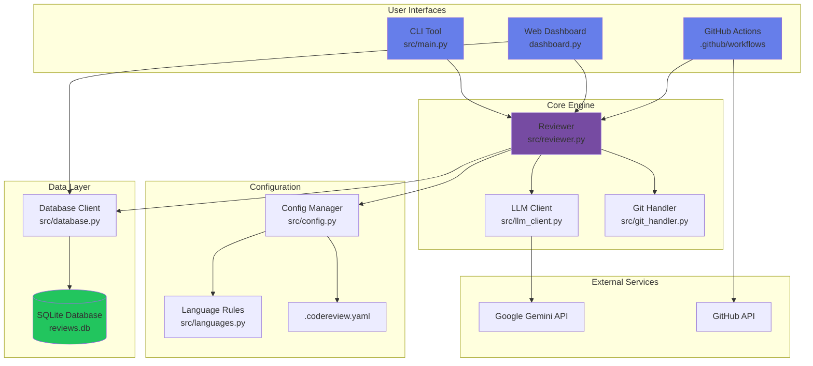

# Architecture Overview

## System Design



## Component Descriptions

### User Interfaces

**CLI Tool** (`src/main.py`)
- Entry point for command-line usage
- Commands: `review`, `init`, `stats`, `config`
- Uses Typer for arg parsing, Rich for output
- Supports multiple diff types and output formats

**Web Dashboard** (`dashboard.py`)
- Streamlit-based web interface
- Real-time analytics from database
- Interactive review execution
- Configuration viewer

**GitHub Actions** (`.github/workflows/code-review.yml`)
- Automated PR reviews
- Posts inline comments on specific lines
- Severity-based categorization
- Fallback to general comments

### Core Engine

**Reviewer** (`src/reviewer.py`)
- Orchestrates review workflow
- Coordinates git, AI, config, and database
- Applies custom rules
- Tracks review metrics (duration, issue counts)

**LLM Client** (`src/llm_client.py`)
- Google Gemini API integration
- Structured prompts for severity categorization
- Error handling and retry logic
- Model selection support

**Git Handler** (`src/git_handler.py`)
- Extracts diffs from repository
- Supports: staged, uncommitted, last-commit
- GitPython integration
- Error handling for edge cases

### Configuration System

**Config Manager** (`src/config.py`)
- Loads `.codereview.yaml` configuration
- Manages custom rules engine
- Pattern matching for file exclusions
- Default configuration fallback

**Language Rules** (`src/languages.py`)
- Multi-language support (Python, JS, Java, Go, Rust)
- Language-specific pattern detection
- Common vulnerability patterns
- Best practice checks

### Data Layer

**Database Client** (`src/database.py`)
- SQLite for review history
- Tables: reviews, issues
- Analytics queries (totals, averages, trends)
- Thread-safe operations

**Schema**:
```sql
reviews (
    id, timestamp, diff_type, file_count,
    critical_count, warning_count, suggestion_count,
    review_text, duration_seconds
)

issues (
    id, review_id, severity, message,
    file_path, line_number
)
```

## Data Flow

### Review Workflow

1. **Input** → User triggers review (CLI/Web/GHA)
2. **Git Extraction** → Get diff from repository
3. **Configuration** → Load rules and settings
4. **AI Analysis** → Send to Gemini for review
5. **Custom Rules** → Apply pattern-based checks
6. **Database** → Save review and metrics
7. **Output** → Display results (terminal/markdown/JSON/PR comment)

### Analytics Workflow

1. **Trigger** → User opens dashboard or runs `stats`
2. **Query** → Fetch from SQLite database
3. **Aggregation** → Calculate totals, averages, trends
4. **Visualization** → Generate charts (pie, timeline)
5. **Display** → Show in web UI or CLI

## Technology Stack

| Layer | Technology | Purpose |
|-------|-----------|---------|
| **AI** | Google Gemini 2.5 Flash | Code analysis |
| **CLI** | Typer + Rich | Command interface |
| **Web** | Streamlit + Plotly | Dashboard |
| **Git** | GitPython | Repository integration |
| **Database** | SQLite | Analytics storage |
| **CI/CD** | GitHub Actions | Automation |
| **Testing** | pytest + pytest-cov | Quality assurance |
| **Config** | PyYAML | Configuration management |

## Design Patterns

**Strategy Pattern**
- Different diff extraction strategies (staged/uncommitted/last-commit)
- Multiple output formats (terminal/markdown/JSON)

**Repository Pattern**
- Database abstraction layer
- Clean separation of data access

**Factory Pattern**
- Configuration loading with defaults
- Language detection and rules

**Observer Pattern**
- Review metrics tracking
- Analytics updates

## Security Considerations

1. **API Key Storage**: Environment variables only, never in code
2. **Input Validation**: Sanitize git diffs before AI processing
3. **Database**: Local SQLite, no external connections
4. **GitHub Actions**: Uses secrets for API keys
5. **Dependencies**: Minimal attack surface

## Performance Characteristics

- **Review Time**: 2-5 seconds per review (Gemini API latency)
- **Database**: Sub-millisecond queries
- **Memory**: <50MB typical usage
- **Concurrency**: Single-threaded (AI API rate limits)

## Future Architecture Improvements

1. **Caching Layer**: Redis for repeated diff reviews
2. **Queue System**: RabbitMQ for async processing
3. **Multi-Model**: Adapter pattern for Claude/GPT-4
4. **Distributed**: Microservices for scale
5. **Real-time**: WebSocket for live updates
