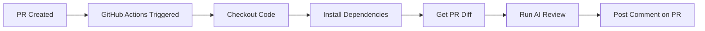

# GitHub Actions Setup Guide

## Overview
This guide will help you set up automatic AI code reviews on your Pull Requests using GitHub Actions.

## Prerequisites
- A GitHub repository (public or private)
- Google Gemini API Key

## Setup Steps

### 1. Push Your Code to GitHub
```bash
# Initialize git (if not already done)
git init

# Add all files
git add .
git commit -m "Initial commit with GitHub Actions"

# Add remote and push
git remote add origin https://github.com/YOUR_USERNAME/YOUR_REPO.git
git push -u origin main
```

### 2. Add GitHub Secret
1. Go to your repository on GitHub
2. Click **Settings** → **Secrets and variables** → **Actions**
3. Click **New repository secret**
4. Name: `GEMINI_API_KEY`
5. Value: Your Google Gemini API key
6. Click **Add secret**

### 3. Enable Workflow
The workflow file is already in `.github/workflows/code-review.yml`. GitHub will automatically detect it.

### 4. Test It
1. Create a new branch: `git checkout -b test-feature`
2. Make some code changes
3. Commit and push: `git push origin test-feature`
4. Create a Pull Request on GitHub
5. Wait ~1-2 minutes for the AI review to appear as a comment

## How It Works



## Workflow Details

- **Trigger**: Runs on PR open, update, or reopen
- **Runtime**: ~1-2 minutes
- **Cost**: $0 (Free for public repos, included in private repo minutes)
- **Output**: AI review posted as PR comment

## Troubleshooting

### No review comment appears
- Check Actions tab for error logs
- Verify `GEMINI_API_KEY` secret is set correctly
- Ensure workflow has PR write permissions

### Review fails
- Check if API key quota is exceeded
- Verify diff is not too large (>100KB may timeout)

## Customization

Edit `.github/workflows/code-review.yml` to:
- Change Python version
- Add additional checks
- Customize comment format
- Filter file types to review
